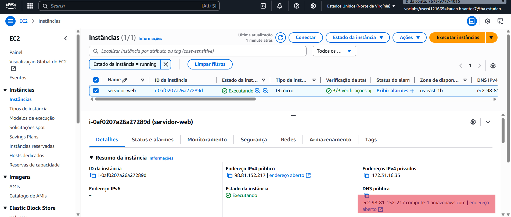
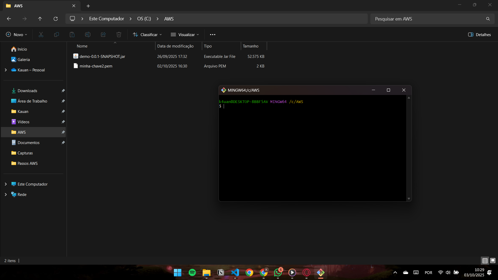
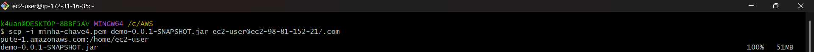
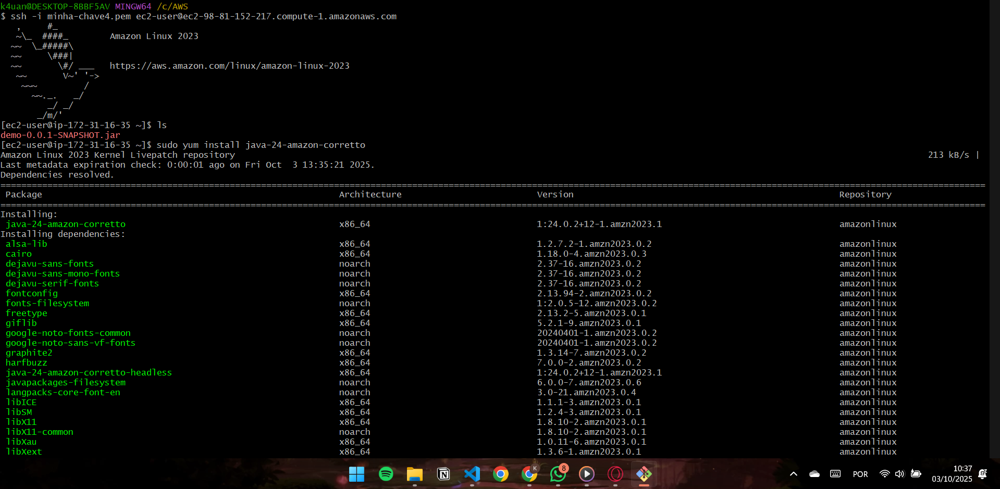

# Deploy de Aplicação Spring Boot na AWS EC2

## 1. Obter o User EC2

A imagem abaixo mostra onde encontrar o **usuário EC2** no painel da AWS:



---

## 2. Abrir o Bash na Pasta AWS

Acesse a pasta onde está sua chave `.pem` e abra o **Git Bash** (ou terminal):

Exemplo:



---

## 3. Copiar o `.jar` para a Máquina Remota (EC2)

Use o comando `scp` para enviar o arquivo `.jar` para sua instância EC2:

```bash
scp -i minha-chave.pem demo-0.0.1-SNAPSHOT.jar ec2-user@ec2-18-205-160-234.compute-1.amazonaws.com:/home/ec2-user
```

> Substitua:
> - `minha-chave.pem` → pelo nome da sua chave  
> - `demo-0.0.1-SNAPSHOT.jar` → pelo nome do seu arquivo `.jar`  
> - `ec2-18-205-160-234.compute-1.amazonaws.com` → pelo endereço público da sua instância EC2



---

## 4. Acessar a Máquina Virtual via SSH

Conecte-se à instância EC2 usando SSH:

```bash
ssh -i minha-chave.pem ec2-user@your-ec2-ip
```

> Substitua `your-ec2-ip` pelo IP público da sua instância.



---

## 5. Instalar o Compilador Java

Dentro da instância EC2, execute:

```bash
sudo yum install java-24-amazon-corretto
```

> Quando for perguntado **y/n**, digite **`y`** para confirmar a instalação.

---

## 6. Rodar a Aplicação Dentro da EC2

Após copiar o `.jar` e instalar o Java, rode o comando:

```bash
java -jar demo-0.0.1-SNAPSHOT.jar
```

Se tudo estiver correto, sua aplicação estará rodando na porta **8080** da instância EC2. ✅

---

## 7. Testar Endpoint no Postman

Use o seguinte formato de URL para testar no **Postman**:

```
http://<user-ec2>:8080/api/v1/products
```

Exemplo:

```
http://ec2-18-205-160-234.compute-1.amazonaws.com:8080/api/v1/products
```
